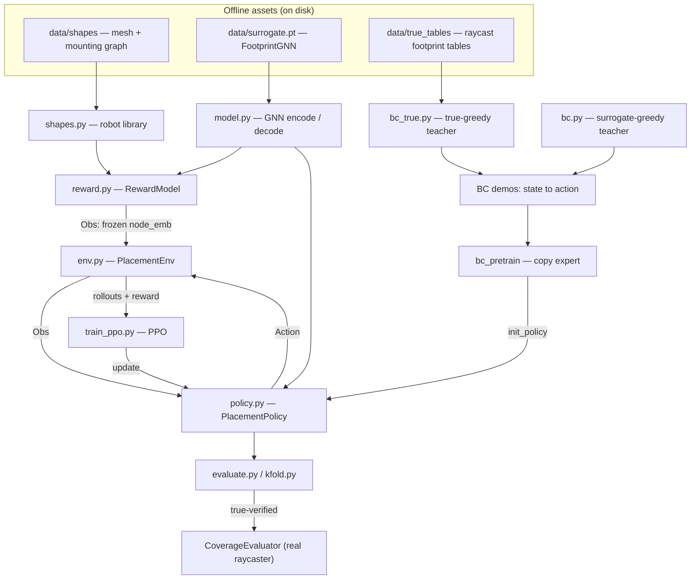
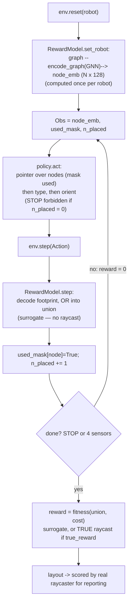
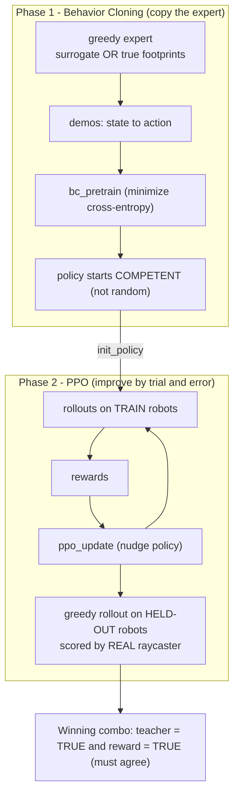
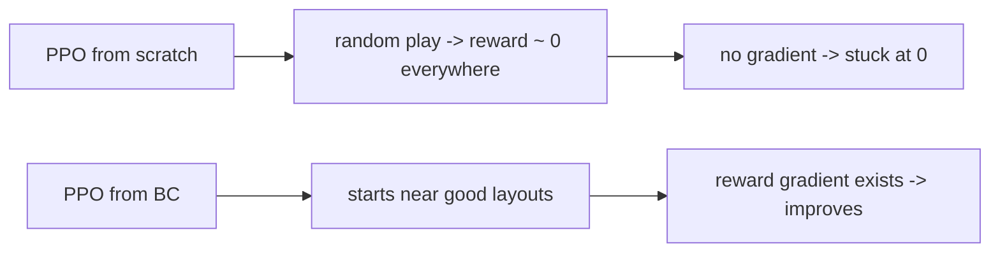
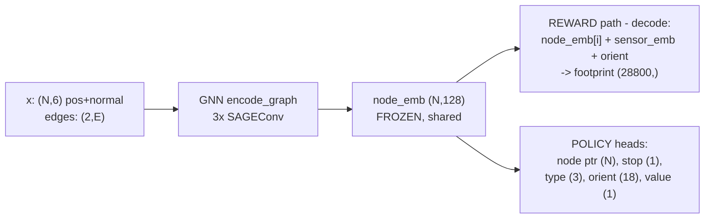

# DRL placement — data-flow diagrams

Mermaid diagrams for the cross-robot zero-shot LiDAR placement RL. Renders in GitHub
and in VSCode (Markdown Preview Mermaid Support).

## 1. System map — where everything lives

## 2. One episode — the inner loop

## 3. Training recipe — why two stages

## 4. Shapes flowing through the networks

