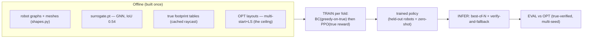
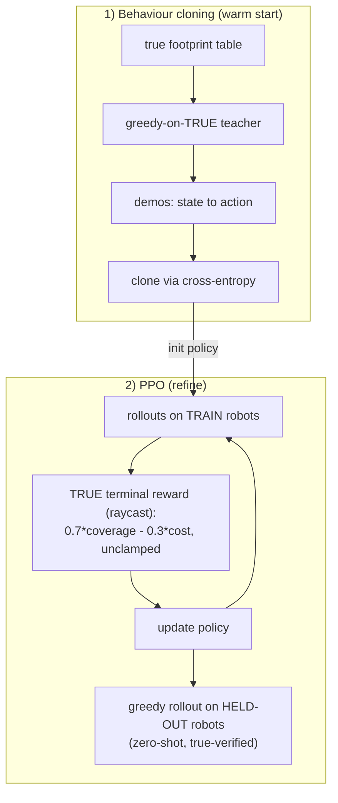
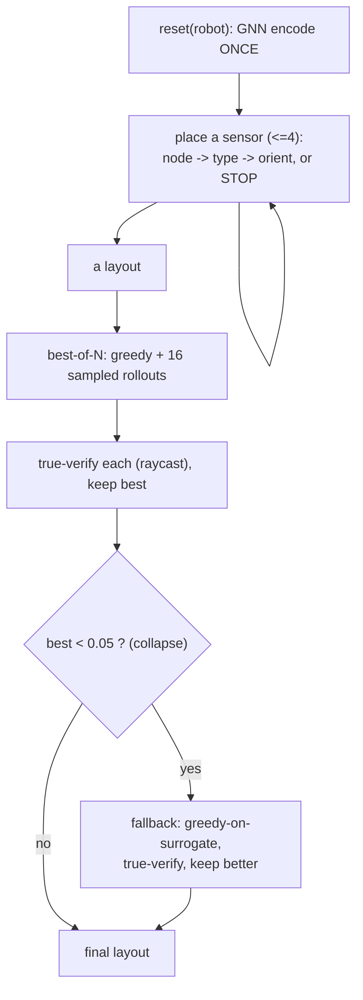
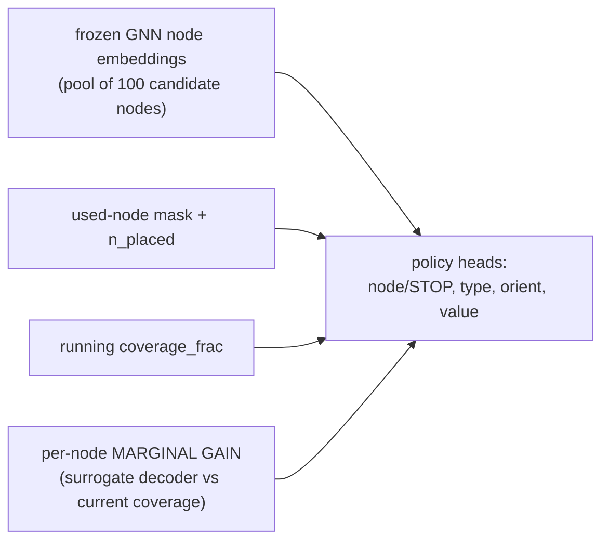
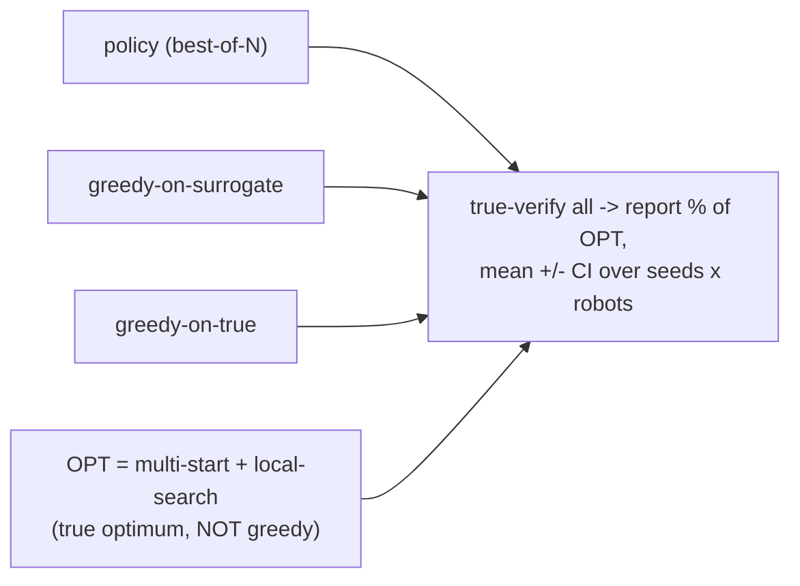

# DRL placement — data-flow (current pipeline)

**Mental model:** one GNN policy places ≤4 LiDARs on an *unseen* robot in a few fast
rollouts. It learns by imitating a greedy expert, then refines with RL. Everything is
scored against the **real raycaster**. Renders in VS Code (Markdown Preview Mermaid).

## 1. Whole pipeline (offline → train → deploy → score)

## 2. Training — how the policy learns

The **reward is the real raycaster**, not the surrogate. PPO-from-scratch fails, so BC
warms it up; teacher and reward both use TRUE coverage (they must agree).

## 3. One episode + inference (best-of-N + fallback)

best-of-N fixes the policy's peakiness (good layouts are in its distribution; greedy
decoding misses them); the fallback is a cheap safety net for rare collapses.

## 4. What the policy SEES (coverage-aware observation)

`coverage_frac` + `marginal_gain` are **state features** (what greedy sees) — they are
*inputs*, NOT the reward. This gives marginal-reasoning info without making a noisy
signal the reward.

## 5. Evaluation — the honest ceiling

Numbers: fleet **OPT ≈ 0.316**; policy best-of-N ≈ **0.240 (~76% of OPT)**. Greedy is
**not** the ceiling — OPT beats greedy by 9–24%.

---

## The surrogate's THREE roles (and one non-role)

| role | where | uses |
|---|---|---|
| **Perception** | policy input | frozen GNN node embeddings (encoder) |
| **Marginal-gain feature** | coverage-aware obs | decoder predicts footprints → per-node gain |
| **Fallback proposer** | inference | greedy-on-surrogate when the policy collapses |
| ~~Reward~~ | — | **NOT used** — reward is the true raycaster |
